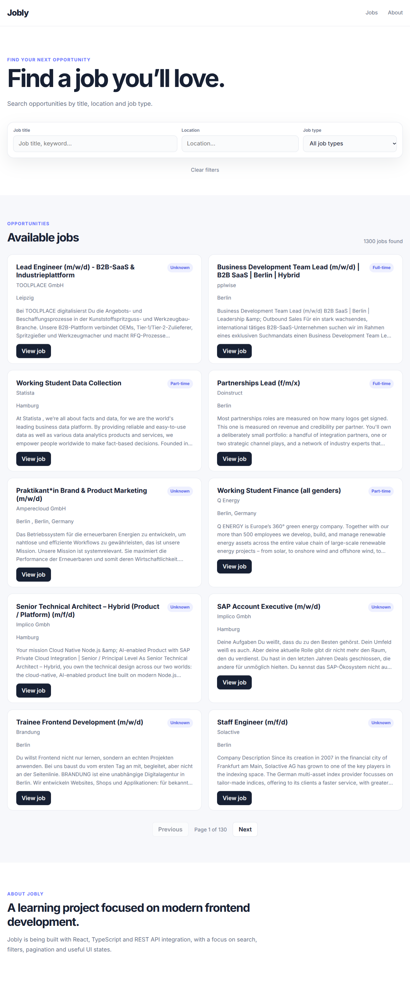
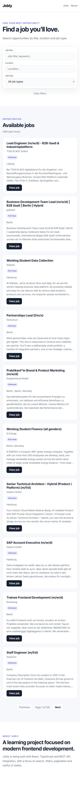

<div align="center">

# 💼 JOBLY

### Modern Job Board Application

**A responsive job board built with React, TypeScript and REST API integration.**

<br>

[](https://react.dev/)
[](https://www.typescriptlang.org/)
[](https://vite.dev/)
[](https://developer.mozilla.org/en-US/docs/Web/CSS)

<br>

### 🔗 [Live Demo](YOUR_DEPLOY_URL) · [Repository] https://github.com/JeanRibeiro8/jobly

</div>

---

## 📸 Preview

<div align="center">

### Desktop



<br><br>

### Mobile



</div>

---

## 🚀 About

**Jobly** is a modern and responsive job board application built to simulate a real-world job search experience.

Users can search for job opportunities, combine different filters, navigate through paginated results and access the original job listing.

The application consumes job data from the **Arbeitnow Job Board API**, transforms the external response into the application's own data structure and renders the information using reusable React components.

> 🎯 **Project goal:** Practice modern frontend development by building a complete application instead of isolated exercises.

---

## ✨ Features

| Feature                 | Description                               |
| ----------------------- | ----------------------------------------- |
| 🔎 **Search**           | Search jobs by title, company or location |
| 📍 **Location Filter**  | Filter opportunities by location          |
| 💼 **Job Type**         | Filter by job type                        |
| 🔄 **Combined Filters** | Use multiple filters simultaneously       |
| 📄 **Pagination**       | Navigate through job results              |
| ⏳ **Loading State**     | Feedback while data is loading            |
| ⚠️ **Error State**      | Error handling with retry functionality   |
| 📭 **Empty State**      | Feedback when no results are found        |
| 🧹 **Clear Filters**    | Reset search and filters                  |
| 📅 **Publication Date** | Display job publication information       |
| 📝 **Description**      | Display job descriptions                  |
| 🔗 **Original Listing** | Access the original job posting           |
| 📱 **Responsive**       | Desktop and mobile friendly               |

---

## 🛠️ Tech Stack

<div align="center">

| Technology           | Purpose                                |
| -------------------- | -------------------------------------- |
| ⚛️ **React**         | UI development                         |
| 🔷 **TypeScript**    | Static typing                          |
| ⚡ **Vite**           | Development environment and build tool |
| 🎨 **CSS3**          | Styling and responsive layout          |
| 🌐 **REST API**      | External job data                      |
| 🔗 **Arbeitnow API** | Job listings                           |
| 📦 **Git**           | Version control                        |
| 🐙 **GitHub**        | Repository and source control          |

</div>

---

## 🧠 What I Practiced

This project was built to strengthen my understanding of modern frontend development.

### React

* Components
* Props
* `useState`
* `useEffect`
* Conditional rendering
* Controlled inputs
* Component composition

### TypeScript

* Interfaces
* Types
* Typed props
* Union types
* Typed API data

### JavaScript

* `map()`
* `filter()`
* `slice()`
* Array manipulation
* Template literals
* Async/await
* Error handling

### API Integration

* `fetch()`
* HTTP response handling
* JSON
* External REST APIs
* Data normalization
* Pagination

### UI Development

* Responsive layouts
* CSS Grid
* Flexbox
* Media queries
* Loading states
* Error states
* Empty states

---

## 🔌 API Architecture

Jobly does not directly use the external API structure throughout the application.

Instead, the data goes through a normalization process.

```text
┌──────────────────────────┐
│    Arbeitnow REST API    │
└────────────┬─────────────┘
             │
             ▼
┌──────────────────────────┐
│       JSON Response      │
└────────────┬─────────────┘
             │
             ▼
┌──────────────────────────┐
│    Data Normalization    │
└────────────┬─────────────┘
             │
             ▼
┌──────────────────────────┐
│       React State        │
└────────────┬─────────────┘
             │
             ▼
┌──────────────────────────┐
│   Search & Filtering     │
└────────────┬─────────────┘
             │
             ▼
┌──────────────────────────┐
│       Pagination         │
└────────────┬─────────────┘
             │
             ▼
┌──────────────────────────┐
│       Job Cards          │
└──────────────────────────┘
```

This approach keeps the frontend independent from the exact structure of the external API.

---

## 🧩 Component Architecture

The interface is divided into reusable React components.

```text
App
│
├── Header
│
├── SearchBar
│   ├── Search input
│   ├── Location filter
│   └── Job type filter
│
├── Job Results
│   └── JobCard
│
├── Pagination
│
└── About Section
```

This structure makes the application easier to maintain and allows individual components to be reused or modified independently.

---

## 🧱 Project Structure

```text
jobly/
│
├── public/
│
├── src/
│   ├── components/
│   │   ├── Header/
│   │   ├── SearchBar/
│   │   └── JobCard/
│   │
│   ├── img/
│   │   ├── jobly.png
│   │   └── jobly-mb.png
│   │
│   ├── App.tsx
│   ├── App.css
│   ├── index.css
│   └── main.tsx
│
├── index.html
├── package.json
├── tsconfig.json
├── vite.config.ts
└── README.md
```

---

## 🧗 Challenges & Solutions

### 🌐 Working with External API Data

The API response structure was not exactly the same structure required by the application.

**Solution:**
I created a normalization layer that converts the external API data into the application's own `Job` structure.

This makes the UI less dependent on the API structure.

---

### 🔎 Search & Multiple Filters

Combining search, location and job type filters required the data to be processed in a predictable way.

**Solution:**
The application applies the search and filters to the normalized job collection before calculating the paginated results.

---

### ⏳ Application States

The interface needed to communicate different situations to the user:

* Loading
* Successful request
* API error
* No matching results

**Solution:**
I implemented dedicated UI states using React conditional rendering.

---

### 📱 Responsive Design

The application needed to provide a good experience on both desktop and mobile.

**Solution:**
I used CSS Grid, Flexbox and responsive media queries to adapt the layout to different screen sizes.

---

## 📚 What I Learned

Building Jobly helped me move from learning individual technologies to combining them into a complete frontend application.

The biggest lessons were:

> **1. APIs are not always structured exactly how your application needs them.**

> **2. TypeScript makes working with external data safer and easier to understand.**

> **3. Good UI needs to handle more than just the successful state.**

> **4. Reusable components make a project easier to maintain.**

> **5. Building a complete project is very different from following isolated tutorials.**

---

## ▶️ Run Locally

### 1. Clone the repository

```bash
git clone https://github.com/JeanRibeiro8/jobly.git
```

### 2. Enter the project

```bash
cd jobly
```

### 3. Install dependencies

```bash
npm install
```

### 4. Start the development server

```bash
npm run dev
```

### 5. Open the application

Vite will provide the local development URL in your terminal.

Usually:

```text
http://localhost:5173
```

---

## 🚀 Deployment

The application is available online:

<div align="center">

### 👉 [Open Jobly](YOUR_DEPLOY_URL)

</div>

---

## 🔮 Future Improvements

Possible future improvements:

* ⭐ Favorite jobs
* 📑 Detailed job pages
* 🔐 User authentication
* 🔍 More advanced filters
* ↕️ Job sorting
* 🧪 Automated tests
* ♿ Accessibility improvements
* 🗄️ Backend integration
* 👤 User accounts

---

## 👨‍💻 Author

<div align="center">

### Jean Ribeiro

**Junior Web Developer | Frontend**

🇧🇷 Brazil · 🌎 Open to International Remote Opportunities

Building modern and responsive web applications while continuously improving my frontend development skills.

<br>

[](https://github.com/JeanRibeiro8)

</div>

---

<div align="center">

### ⭐ If you found this project interesting, consider giving it a star!

**Built with React + TypeScript + REST API**

</div>
